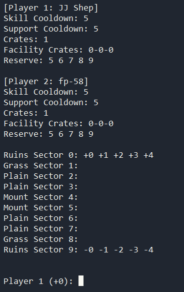

# FieldShift BoardCT
Python implementation of my original game, FieldShift. FieldShift is a simple 1v1 turn-based strategy game played in the terminal.

The tool first takes each player's commands as input and calculates the result based on the game's rules. Afterwards, it prints the updated information on each player's resources as well as the updated contents of the board. This process repeats until a player wins.

The game's manual is included as a PDF. It was intentionally designed to look complicated in theory but simple in practice. My design philosophy has changed since then, but that idea is what originally inspired FieldShift.

## How to use
To start a game, both players must start the tool and enter their names when prompted. Players must communicate their commands to each other externally, then enter them into the tool. For example, if player one chose `25`, both player one and player two would enter `25` into BoardCT and the tool would then end player one's turn.

## Installation
Binaries for Windows 10/11 and Linux amd64 are available in the releases section. The original Python file in the repository also includes a `#!` for quicker execution on Linux systems when moved to a directory on the `$PATH`.

## Notice on commit messages
This project was done before I knew how to make a proper commit message. As a result, the commit messages in this repository are not very helpful or descriptive, and I often included multiple changes in a single commit. 

## Credits
[JJ-Shep](https://github.com/JJ-Shep): Game rules and manual, balancing, programming and testing

[fp-58](https://github.com/fp-58): Programming and testing, efficiency and organization improvements
